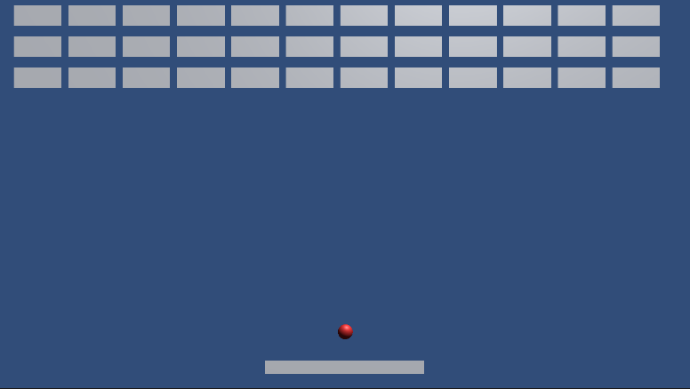
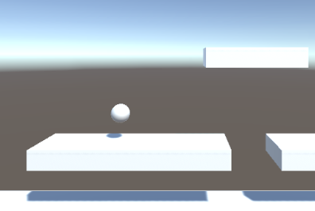

# Portfolio

- 杉田夏葵
- 専門学校デジタルアーツ東京 ゲームプログラムコース 2024年卒業予定

## スキル
- C#
  - 利用歴1年
- Unity
  - 利用歴1年
  - オリジナルの個人作品の開発経験あり
- C/C++
  - 利用歴1年
  - コンソールで簡単なデータ処理プログラムを開発

## 取り組んでいるテーマ
1. オリジナルゲーム開発

## 作品リスト

### ブロック崩し

[ブロック崩し](URL)

バーを操作してボールを跳ね返してブロックを全て消すゲーム。

- 開発環境：Unity
- 開発期間：3週間

### リフレクションボール

[リフレクションボール](https://unityroom.com/games/reflectionball)

ボールをマウスで引っ張ってゴールを目指すゲーム。

- 開発環境：Unity
- 開発期間：2週間
- 1週間ゲームジャム「Re」参加作品

## 連絡先
