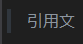

# 大見出し
## 中見出し
### 小見出し

普通の文字。

**太字**。

*斜体*

~~取り消し線~~

X
<sub>2<sub>

X
<sup>2<sup>

以下抜粋。	
> 引用文

整数は`int型`がよい。

```cs
int a;
a = 1;
Debug.Log($"a");
```

[REAMME.md](README.md)へのリンク



- あああああああ
- ああああああど
  - あああ
    - あああ

1. あ
   - あああ
1. ああ
1. あああ

- [ ] 作業
- [x] あ
- [x] あいう
 
 |No|氏名|フリガナ|
 |-:|:-:|:-|
 |1|ああ|ああ|
 |2|いいいい|いいいい|
 |3|うう|うう|